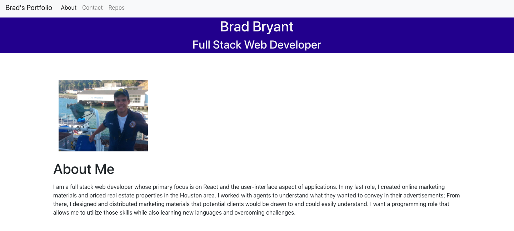
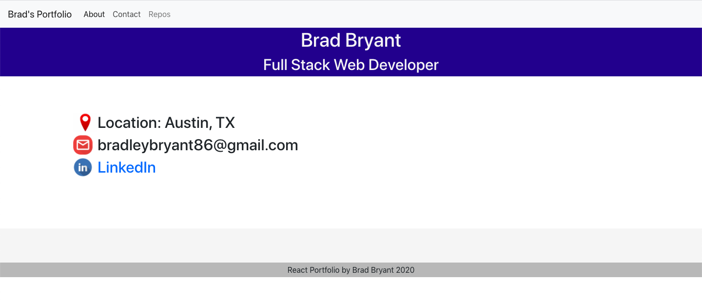

# React Portfolio

This portfolio was made by me, Brad Bryant, using only React.js.

;
;

## Installation

Type "npx create react app" in your terminal.
Use app.js to place necessary components for your app.

## Usage

Click the deployed site to open
OR if using VS code...
Right click the "src" folder in your terminal.
Click "open in terminal".
In the terminal type "npm start". 

## Notes
Some of the components used in this app are modeled after the Pupster app created by Trilogy Education Services. 

## License
Brad Bryant 2020
